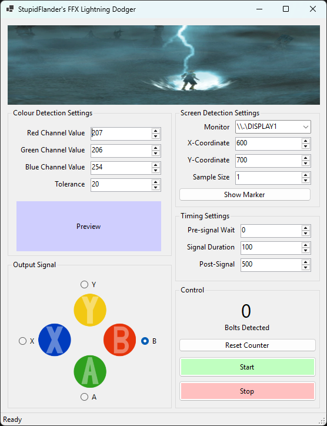

# FFXLightningDodger

## Purpose
This application automates the dodging of lightning in Final Fantasy X. This was designed and tested for PS2 emulation (in particular the FFX International Edition on PCXS2), but should also work with the Steam HD remasters as well. I used this tool to get 200+ consecutive lightning bolt dodges on 200% base game speed.

## How It Works
This program follows this simple algorithm:
1. Samples pixels from a designated position on screen.
2. Compares all pixels in selection against pre-defined colour (colour of lightning bolt flash)
3. If a lightning bolt IS NOT detected, go back to step 1.
4. If a lightning bolt IS detected:
    i.  A small wait occurs to simulate human reaction times
    ii. A signal is sent using XInput to signify a button is being held down.
    iii. A small wait occurs to simulate human button press duration.
    iv. A signal is sent using XInput to signify the button has been released.
    v. A small wait occurs to avoid processing the small lightning bolt twice.
5. Repeat from step 1.

## Customisable Features

- Colour detection by RGB values
- Multiple monitor support
- Sample from anywhere on screen
- Timing configurations
- Send input using XInput

## Basic Usage
1. Position yourself here in the nook in the Southern Thunder Plains.

2. Launch the program. Once you launch the program a simulated XInput controller is created.
3. Reconfigure your game/emulator inputs to be this new simulated controller. Ensure the selected output signal is the button you need to be firing to dodge lightning bolts within the game.
4. Click 'Start'.

## Screen Detection

You can modify the X and Y offsets from where the pixels will be sampled. By clicking the 'Show Marker' button a temporary red marker will be displayed over the pixel region of where the pixels will be sampled from as a visual indicator.

The offsets begin at the top left of the screen as the origin (0,0) point.
